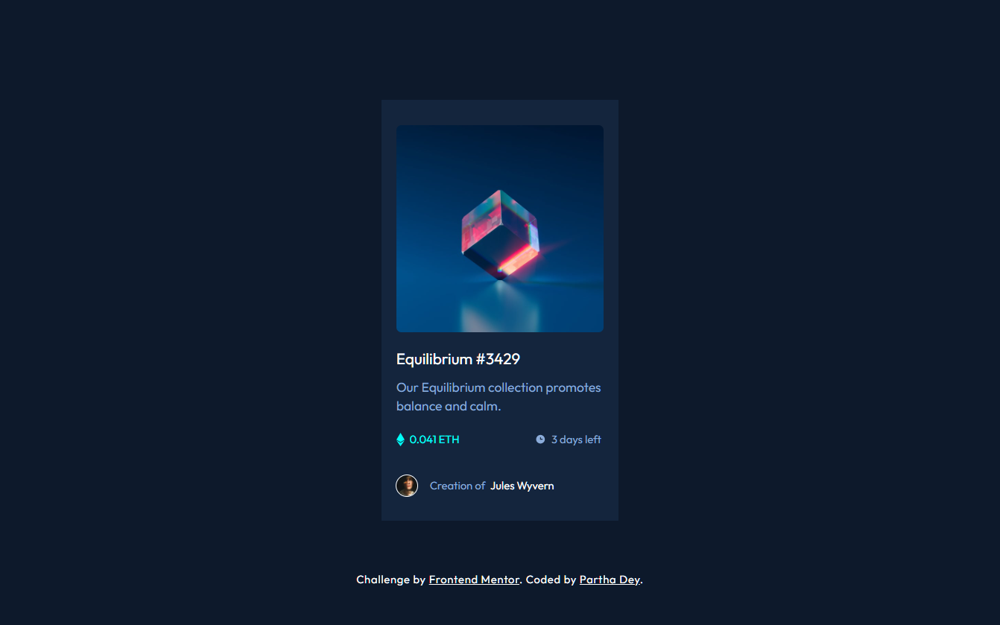

# Frontend Mentor - NFT preview card component solution

This is a solution to the [NFT preview card component challenge on Frontend Mentor](https://www.frontendmentor.io/challenges/nft-preview-card-component-SbdUL_w0U). Frontend Mentor challenges help you improve your coding skills by building realistic projects.

---

## Table of contents

- [Overview](#overview)
  - [The challenge](#the-challenge)
  - [Screenshot](#screenshot)
  - [Links](#links)
- [My process](#my-process)
  - [Built with](#built-with)
  - [What I learned](#what-i-learned)
  - [Continued development](#continued-development)
  - [Useful resources](#useful-resources)
- [Author](#author)
- [Acknowledgments](#acknowledgments)

---

## Overview

### The challenge

Users should be able to:

- View the optimal layout depending on their device's screen size
- See hover states for interactive elements

### Screenshot



### Links

- Solution URL: [https://github.com/ParthaDey5/nft-preview-card-component-main]
- Live Site URL: [https://your-live-site-url.com](https://your-live-site-url.com)

---

## My process

### Built with

- Semantic **HTML5** markup
- **Tailwind CSS** utility classes
- **BEM methodology** for semantic structure layered over Tailwind
- Flexbox
- Mobile-first workflow

### What I learned

While building this project I reinforced:

- How to combine **Tailwind utilities** with **BEM naming** for clarity and scalability.
- Applying custom cursors with `cursor: url(...) hotspot, fallback;`.

Example snippet I’m proud of:

```html
<div class="nft-card__image-wrapper relative">
  
  <div class="nft-card__overlay absolute inset-0 bg-[hsl(178,100%,50%)]/50 flex items-center justify-center cursor hidden">
    
  </div>
</div>
```

### Continued development

- Explore **CUBE CSS layering** with Tailwind for larger projects.
- Refine responsive breakpoints and fluid typography.
- Experiment with **custom cursors** and micro-interactions for better UX.

### Useful resources

- [Tailwind CSS Docs](https://tailwindcss.com/docs) – for utility-first styling.
- [BEM Methodology](http://getbem.com/) – for semantic class naming.
- [Frontend Mentor](https://www.frontendmentor.io) – for realistic practice challenges.

---

## Author

- Website – [Partha Dey](https://portfolio-delta-ten-55.vercel.app)
- Frontend Mentor – [@ParthaDey5](https://www.frontendmentor.io/profile/ParthaDey5)


---

## Acknowledgments

Thanks to the Frontend Mentor community for feedback and inspiration. Special credit to resources and discussions that helped me align Tailwind with BEM methodology.
```

